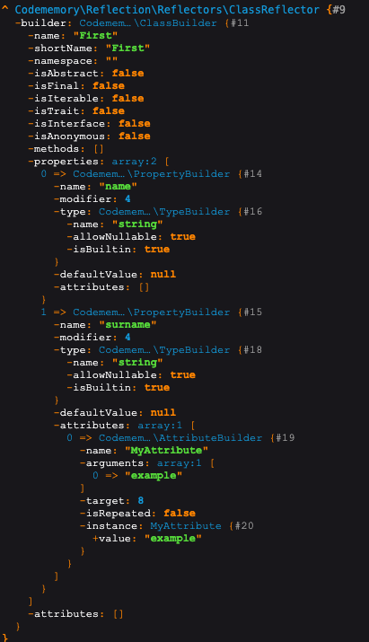

## Codememory Reflection
#### This library will please the built-in Reflection API in PHP, but with one plus, it is fully cacheable

### Install
```shell 
$ composer require codememory/reflection
```

### Usage example

```php
<?php

use Symfony\Component\Cache\Adapter\FilesystemAdapter;
use Codememory\Reflection\ReflectorManager;
use Attribute;

// Let's create a cache adapter
// Read more about the cache in the documentation https://symfony.com/doc/current/components/cache.html
$cache = new FilesystemAdapter('codememory', directory: 'cache');

// Create a reflection manager
$rm = new ReflectorManager($cache, false); // The second argument specifies the application environment (isDev), dev mode is enabled by default

#[Attribute(Attribute::TARGET_PROPERTY)]
final class MyAttribute {
    public function __construct(
        public readonly mixed $value
    ) {}
}

// Let's create a class from which we will receive information
class First {
    private ?string $name = null;
    
    #[MyAttribute('example')]
    private ?string $surname = null;
}

// Get class reflection
$classReflector = $rm->getReflector(First::class); // Codememory\Reflection\Reflectors\ClassReflector

echo $classReflector->getName(); // First
```

### Result



### Cache
> 0
First
a:12:{s:4:"name";s:5:"First";s:10:"short_name";s:5:"First";s:9:"namespace";s:0:"";s:11:"is_abstract";b:0;s:8:"is_final";b:0;s:11:"is_iterable";b:0;s:8:"is_trait";b:0;s:12:"is_interface";b:0;s:12:"is_anonymous";b:0;s:7:"methods";a:0:{}s:10:"properties";a:2:{i:0;a:5:{s:4:"name";s:4:"name";s:8:"modifier";i:4;s:4:"type";a:3:{s:4:"name";s:6:"string";s:14:"allow_nullable";b:1;s:10:"is_builtin";b:1;}s:13:"default_value";N;s:10:"attributes";a:0:{}}i:1;a:5:{s:4:"name";s:7:"surname";s:8:"modifier";i:4;s:4:"type";a:3:{s:4:"name";s:6:"string";s:14:"allow_nullable";b:1;s:10:"is_builtin";b:1;}s:13:"default_value";N;s:10:"attributes";a:1:{i:0;a:5:{s:4:"name";s:11:"MyAttribute";s:9:"arguments";a:1:{i:0;s:7:"example";}s:6:"target";i:8;s:11:"is_repeated";b:0;s:8:"instance";O:11:"MyAttribute":1:{s:5:"value";s:7:"example";}}}}}s:10:"attributes";a:0:{}}